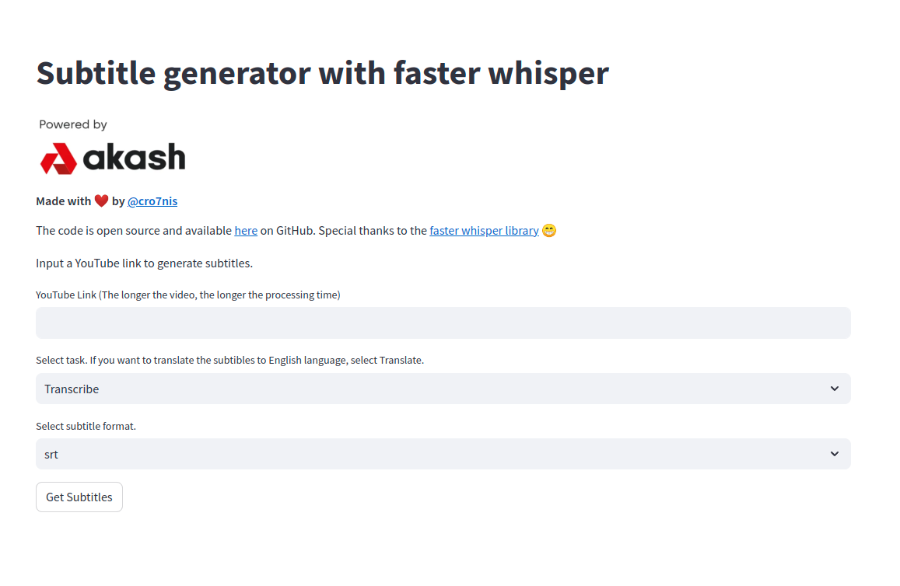

# Subtitle Generator

Automatic subtitle generator using [faster whisper](https://github.com/SYSTRAN/faster-whisper) repo. Faster whisper is a remplementation of  [OpenAI's Whisper](https://github.com/openai/whispermodel) using CTranslate2 for faster inference.

The Subtible generator consists of an API that is built with [FastAPI](https://fastapi.tiangolo.com/) and a UI powered by [Streamlit](https://streamlit.io/).

## Host on Akash  

- Follow the [Akash docs](https://akash.network/docs/deployments/cloudmos-deploy/) to get started with deployments
- When ready, use the [deploy.yaml](deploy.yaml) to the Akash SDL prompt and deploy
  - In order to generate subtibles faster, api service needs to run on GPU with more than 3GB VRAM available
  - The [deploy.yaml](deploy.yaml) is tested on sandbox network and currenly has minimal resource requirements. Consider increasing them to improve speed.



## Docker

- Build the API

   ```
   docker build . -f docker/service.Dockerfile -t <service-image-name>
   ```

- Build the UI

   ```
   docker build . -f docker/ui.Dockerfile -t <ui-image-name>
   ```

- Run the API

   ```
   docker run --gpus '"device=<device-id>"' -e DYNACONF_API__SERVER__BIND=<port> --network host --gpus all <service-image-name>
   
   ```
  
  - `<device-id>` the gpu id
  - `<port>` the API port (default: 8050)
  - to change the model size add `-e DYNACONF_TRANSCRIBER__MODEL <model-size>` (default: medium)
    - `<model-size>` values: base, small, medium, large


- Run the UI

   ```
   docker run --network host -e PORT=<ui-port> -e DYNACONF_API__HOST=<api-host> -e DYNACONF_API__PORT=<api-port> <ui-image-name>
   ```

  -   `<port>` the UI port (default: 8051)
  -   `<api-host>` the host address (default: localhost)
  -   `<api-port>` the UI port  (default: 8050)


<hr>

## Docker compose

- Deploy API and UI

```
docker-compose -f docker/docker-compose.yml up 
```


<hr>

## API documentation

```    
http://<api-host>:<api-port>/subtitle/api/v1/docs
```